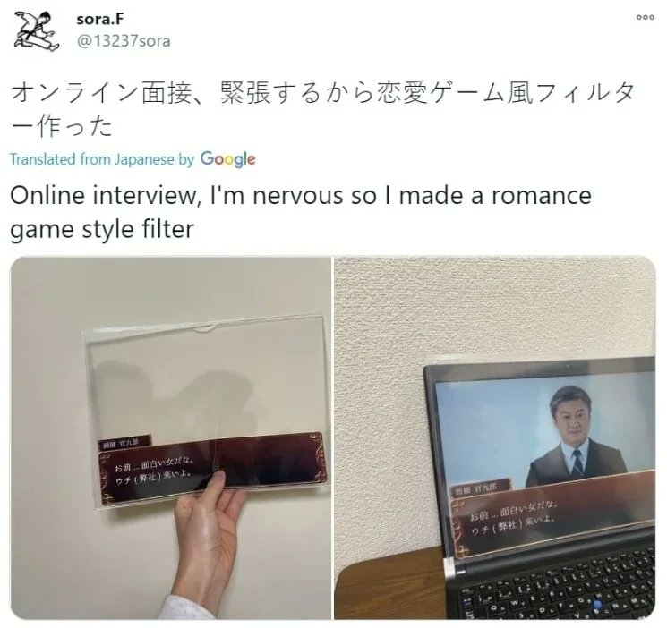

# **delulu solulu** 💕  
*A romantic speech translator powered by PyQt5*  

## **Overview**  
Delulu Solulu is the solution to your delusions! Have a Zoom crush? Or just nervous for an online interview? We've got you covered! Simply use this filter that turns your video call into a dating sim! 

## Foreword
This project was created during the Hack&Roll 2025 hackathon hosted by NUS Hackers. We're a team of 3 JC grads that had the opportunity to attend a CS1 course and just started learning python a month before the hackathon ๑(° Д°"๑). We entered the hackathon to have fun, and also put our new skills to the test, although 99% of the coding we had to do was outside of what we learnt in the course 😅😅😅. The whole hackathon was really exciting and fun, and we even got to experience firsthand what it felt to be cold, homeless smelly CS students(no joke it was freezing both inside and outside and we decided to sleep on the benches outside the dining hall where the hackathon was being held ಥ_ಥ). We're proud of what we were able to accomplish in those 24 hours and to have an actual working final productヾ(≧∇≦)ゞ. Our goal was to create something funny and useless, and through this project, we’ve learned a lot more about Python, audio processing, APIs, and much more. We hope you enjoy using(don't use it) this filter as much as we enjoyed building it!

## **Inspiration**
A random tweet by a random japanese guy. Peak humour. Captions: "You... are such an interesting woman. Come to me (My company)."

## **Demo**  
[demo](delulu_solulu/images/demo.mp4)

## **Features**  
- 💌 Translates speech into poetic and romantic captions 
- 🌹 Aesthetic retro dating sim UI  
- 💗 Makes you feel like a princess

## **Tech Stack**  
- **Python** (Core logic)  
- **PyQt5** (GUI framework)
- **Gemini LLM API** (Translation model)
- **Virtual Audio Cable** (Audio processing)

## **Team & Credits**  
- **[@geguul](https://github.com/geguul)** - Creator, UI design, GUI development, Speech translator
- **[@gergerzies](https://github.com/gergerzies)** - Blush filter
- **[@tomboychau](https://github.com/tomboychau)** - GUI development

## **Challenges & Learnings**  
- We wanted to implement a blush filter and kept running into issues, but we didn't give up until the last minute（ﾉ｡≧◇≦）ﾉ. Alas, it still couldn't work properly so we decided to forgo it (ಥ ̯ ಥ). RIP Blush, we'll always remember you💔💔💔.
- Working with PyQt5 for GUI development
- Working with Gemini's API and chat completions for romantic text generation
- Using Krita to photoshop UI designs
- Using Python's speechrecognition and an audio repeater to process audio
